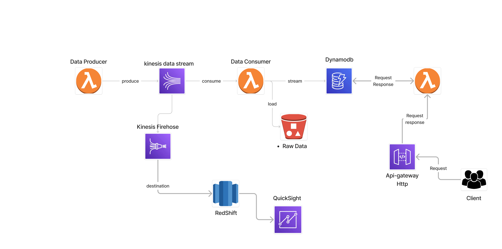

# Aws-real-time-property-search-pipline_cdk!
This pipline is base on real-time real estate property search it simulate 200 of property data using Faker libery to generate the data and stream the data to kinesis then another lambda function consume the data and load to dynamodb and then use apigateaway and another lambda function to send request to dynamodb.
lastly use firehose to send the real time data to redshift for futher analytics

## Architechure Diagram

```
$ python -m venv .venv
```


If you are a Windows platform, you would activate the virtualenv like this:

```
% .venv\Scripts\activate.bat
```

Once the virtualenv is activated, you can install the required dependencies.

```
$ pip install -r requirements.txt
```

At this point you can now synthesize the CloudFormation template for this code.

```
$ cdk synth
```

