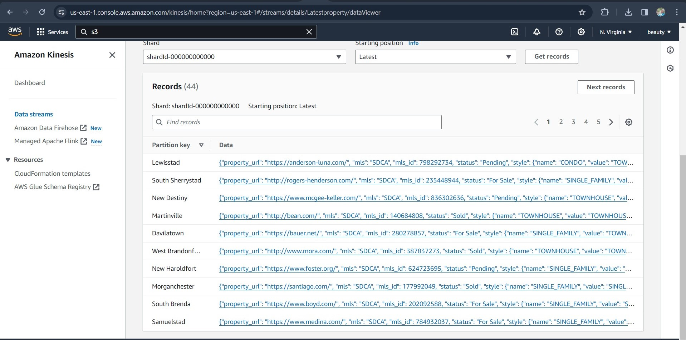
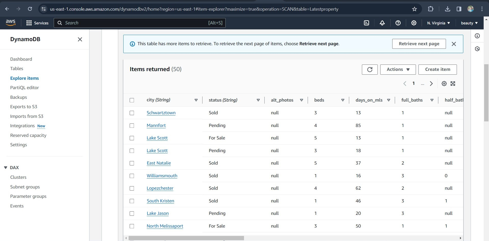
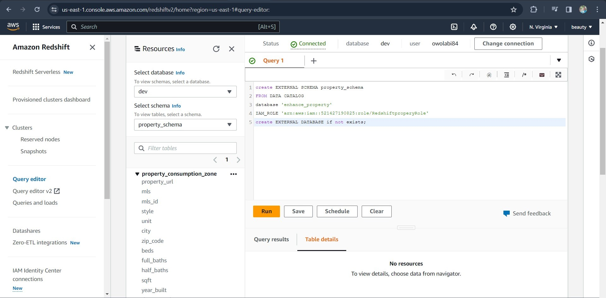
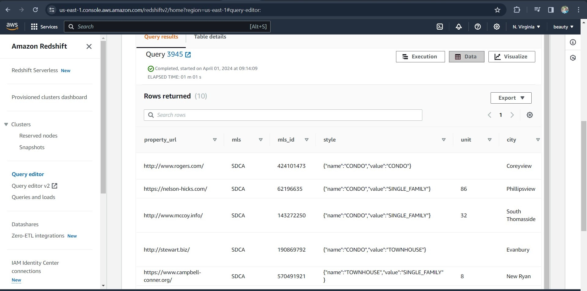
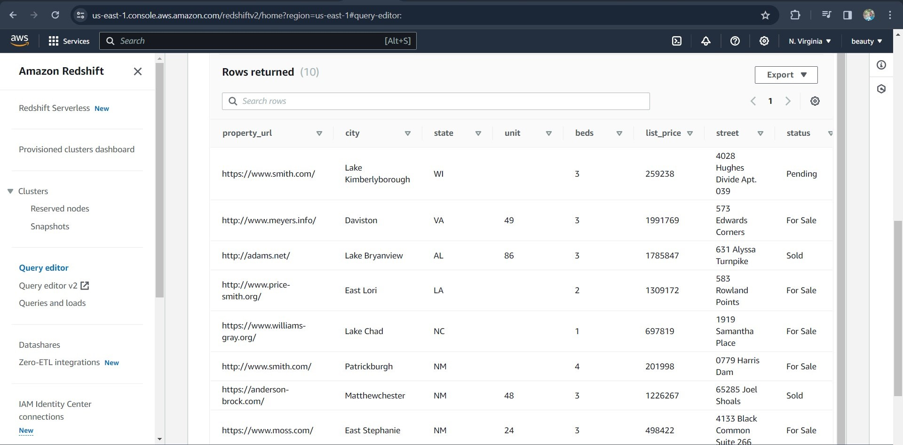

# Aws-real-time-property-search-pipline_cdk!
This pipline is base on real-time real estate property search. it simulate 200 of property data using Faker libery to generate the data and stream the data to kinesis then another lambda function consume the data and load to dynamodb and then use apigateaway and another lambda function to send request to dynamodb.
secondly use firehose to send the real time data to raw zone s3 bucket then create a catalog with glue clawler, perform glue Etl job to convert the data for parquet format for query optimaztion lastly query the data using redshift data warehouse.....


## Architechure Diagram


## Sample kinesis real time data


## Sample Dynamodb Data


## Sample Athena Query


## Create extenal schema property_schema redshift


## Sample Redshift query result





```
$ python -m venv .venv
```


If you are a Windows platform, you would activate the virtualenv like this:

```
% .venv\Scripts\activate.bat
```

Once the virtualenv is activated, you can install the required dependencies.

```
$ pip install -r requirements.txt
```

At this point you can now synthesize the CloudFormation template for this code.

```
$ cdk synth
```

